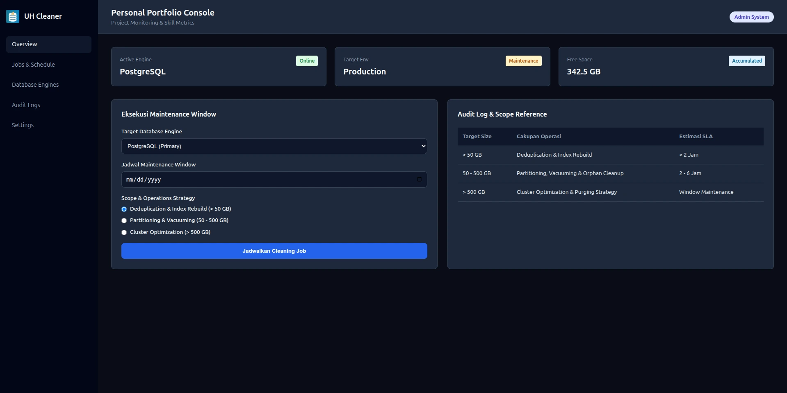

# Tugas Web Pertemuan 2 - Dashboard

Proyek ini adalah implementasi antarmuka **UH Database Cleaner Console** menggunakan HTML5 Semantik, CSS Grid, dan Flexbox.

## Tampilan Application

## Fitur & Persyaratan Teknis
- **HTML5 Semantik**: `<header>`, `<aside>`, `<main>`, `<nav>`
- **CSS Grid**: Digunakan untuk struktur makro layout (Sidebar & Main Content)
- **Flexbox**: Digunakan pada komponen Stats Card, Navigasi, dan Form Control
- **CSS Variables**: Terdefinisi di `:root` untuk konsistensi tema
- **Theme**: Mendukung Dark Mode bawaan via `@media (prefers-color-scheme: dark)`
- **Styling**: Konvensi penamaan BEM / kebab-case & `box-sizing: border-box` global
