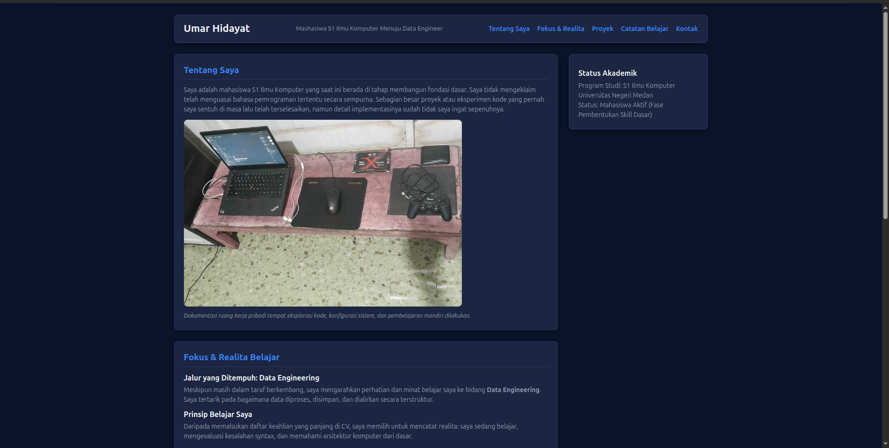

# Tugas Web Pertemuan 2 - Portofolio Personal

Repository ini berisi tugas mata kuliah Pemrograman Web (Pertemuan 2) untuk membuat landing page dan portofolio pribadi berbasis HTML5 dan CSS.

## 📌 Tampilan Halaman



## 🛠️ Teknologi yang Digunakan

* **HTML5**: Struktur semantic web (`<header>`, `<nav>`, `<main>`, `<section>`).
* **CSS3**: Stiling dan tata letak halaman (`style.css`).

## 📁 Struktur Berkas

```text
.
├── index.html        # File utama struktur HTML
├── style.css         # Document stylesheet CSS
├── Foto_Setup.webp   # Aset gambar portofolio
└── SS.png            # Screenshot tampilan proyek